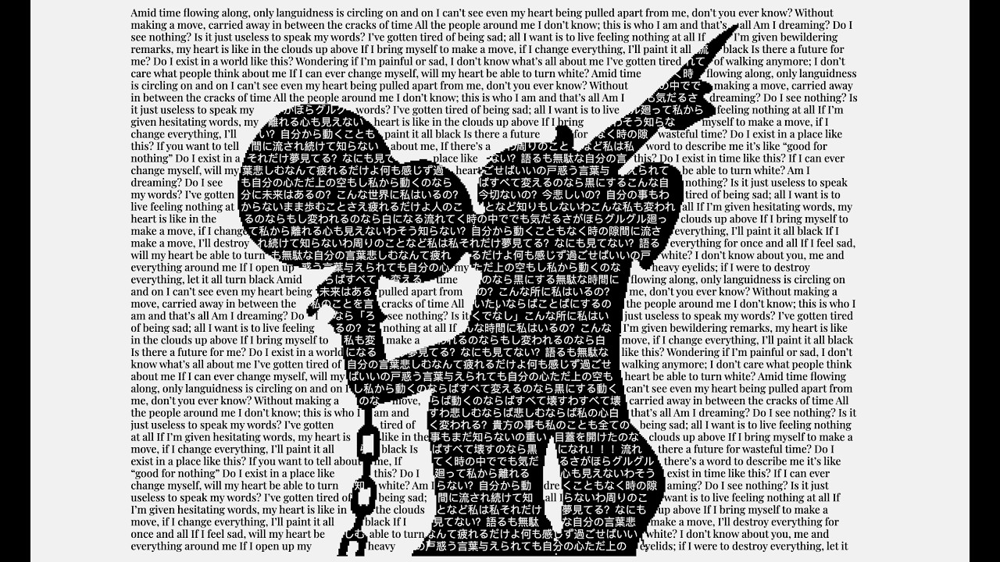

# Bad Apple!! - Pretext Rendering Experiment

So, I just saw the amazing `@chenglou/pretext` library and immediately felt the urge to build something with it. I'd seen an example of Chika Fujiwara from *Kaguya-sama: Love is War* dancing in the middle of a block of text, and it hit me: recreating the classic "Bad Apple!!" animation (yet again) would be the perfect way to test this engine's limits, as well as a great opportunity to teach my students at the university a bit about RLE optimization.

## A bit of the process
Instead of decoding video on the fly, I extract the frames via a custom Python script using OpenCV and NumPy, map them to a logical grid, and binarize the pixel data. The output is compressed using Run-Length Encoding (RLE) to define horizontal "segments" of continuous color, which is then exported as a flat binary file (`frames.bin`).

I utilize the `Pretext` library (specifically `prepareWithSegments`) to parse the lyrics and calculate glyph metrics purely in RAM upon initialization. This bypasses DOM layout reflows entirely and guarantees constant-time measurement lookups during playback.

During runtime, the engine syncs the binary frame offsets to the master `audio.currentTime`. For each frame:
* It reads the binary segments to determine the spatial boundaries.
* It uses Pretext's `layoutNextLine` API to request the next line of text that perfectly fits within the segment's width.
* Rendering is offloaded to the GPU via the Canvas `ctx.fillText` API.

## Results & Optimizations
Initially, scaling up the resolution triggered severe CPU bottlenecks, audio desynchronization, and micro-stutters. The application now effortlessly handles a **fine granularity of 120 text rows** .

* **State Batching & Frame-Limiting:** Canvas API context switches (`fillStyle`, `font`) were reduced from thousands to exactly 3 per frame. Additionally, rendering skips redundant updates on high-refresh-rate monitors (60Hz to 144Hz+), locking processing strictly to the source video's 30 FPS.
* **Object Pooling (Zero GC Stutters):** Arrays are completely recycled inside the render loop rather than allocated on the fly. This eliminated Javascript Garbage Collector spikes, which were previously starving the audio thread and causing crackling.
* **VoD Chunked Streaming:** Replaced the initial full-buffer blocking fetch with a progressive `ReadableStream` parser. Playback safely unlocks within the first 5 seconds while data streams into shared memory in the background, guarded against network-starvation desyncs.
* **Integer Coordinate Locking:** Truncated all scale transformations to strict pixel integers, disabling expensive browser sub-pixel anti-aliasing interpolation during layout redraws.

Due to the significantly higher text-density grid layout, the memory footprint has scaled to an average of **70-80 MB**, but still not bad. I know it isn't perfect, but I hope you have as much fun watching it as I had building it!